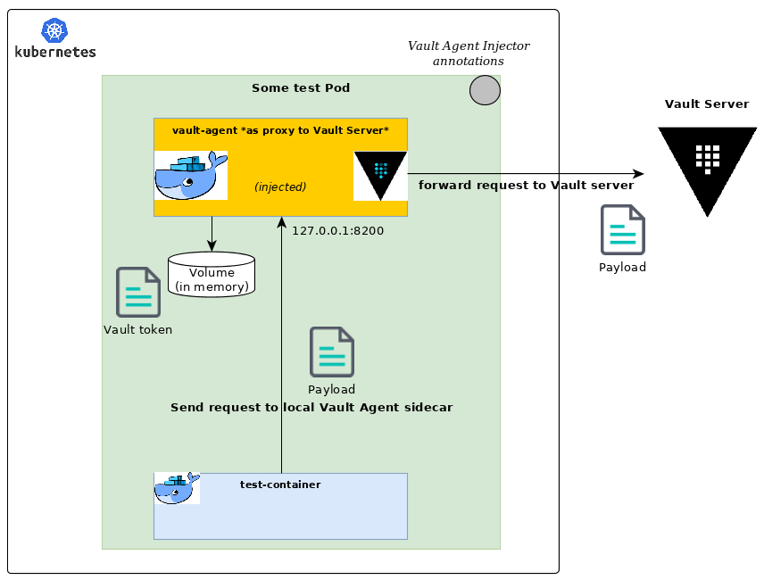

# Discovering Vault Proxy feature

`Open Vault Agent Injector` exposes a Vault proxy feature. This feature unlocks many scenarios as it opens up full access to every Vault endpoints without the hassle to authenticate against the Vault server and manage issued tokens on your side.

To do so, we set in the injected sidecar the necessary configuration to transform the running Vault Agent into a local proxy forwarding any requests from your application to the attached Vault server with a valid Vault token.

It is also possible to disable dynamic secrets retrieval and benefit only from the proxy capabilities of the injected Vault Agent sidecar (as you may not need or want to deal with secrets on some occasions).

All of this is achieved using the brand new **modes** mechanism relying on the `ovai.asaintsever.org/mode` annotation. With **modes** you can enable part or all of the features you need depending on your use case. Details are available in the [documentation](../Usage.md#modes).

The provided `app-job-2-proxy` and `app-job-3-secrets-proxy` [samples](https://github.com/asaintsever/open-vault-agent-injector/blob/master/samples) show some of the possible combinations.
